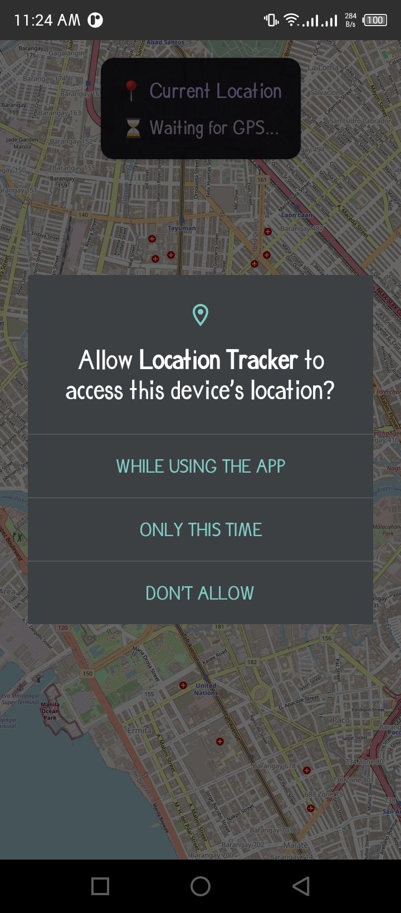

APP DESCRIPTION >>

A real-time GPS location tracking app that displays the user's current position on an interactive OpenStreetMap. The app continuously monitors location changes and updates a marker on the map, showing latitude/longitude coordinates with timestamps and update counters. Built with Jetpack Compose and Material 3 design.

PERMISSIONS USED >>
1. ACCESS_FINE_LOCATION - For precise GPS location tracking
2. ACCESS_COARSE_LOCATION - For approximate location (fallback option)
3. INTERNET - Required to download map tiles from OpenStreetMap servers
4. ACCESS_NETWORK_STATE - To check network connectivity for map loading
5. WRITE_EXTERNAL_STORAGE (SDK ≤32) - For caching map tiles locally

HOW GPS LOCATION IS OBTAINED >>

The app uses Google Play Services' FusedLocationProviderClient for GPS tracking:
1. Permission Check: On startup, the app checks for location permissions and requests them if not granted using ActivityResultContracts
2. Location Request Configuration: Creates a LocationRequest with HIGH_ACCURACY priority, requesting updates every 5 seconds (minimum 2 seconds between updates)
3. Continuous Updates: Registers a LocationCallback that receives location updates via requestLocationUpdates() on the main looper
4. Location Processing: Each update extracts latitude/longitude from the LocationResult, converts it to a GeoPoint, and updates both the map center and marker position
5. Lifecycle Management: Properly removes location updates in onDestroy() to prevent battery drain

The FusedLocationProviderClient intelligently combines GPS, Wi-Fi, and cell tower data to provide the most accurate location with optimal battery usage.

SCREENSHOTS >>

	
	
	

